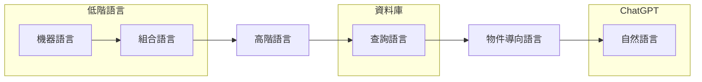
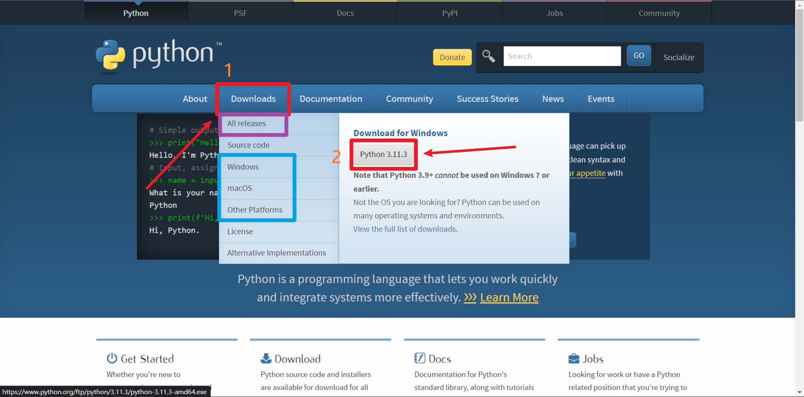
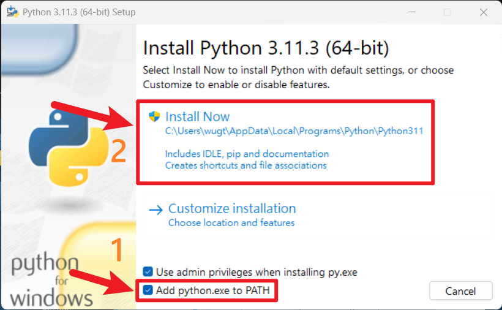

---
# try also 'default' to start simple
theme: default
# random image from a curated Unsplash collection by Anthony
# like them? see https://unsplash.com/collections/94734566/slidev
background: https://source.unsplash.com/collection/94734566/1920x1080
# apply any windi css classes to the current slide
class: 'text-center'
# https://sli.dev/custom/highlighters.html
highlighter: shiki
# show line numbers in code blocks
lineNumbers: false
# some information about the slides, markdown enabled
info: 
# persist drawings in exports and build
drawings:
  persist: true
# page transition
transition: slide-left
# use UnoCSS
css: unocss

---

# STEM

Python

<div class="pt-12">
  <span  class="px-2 py-1 rounded cursor-pointer" hover="bg-white bg-opacity-10">
    <a class="text-xl icon-btn !border-none" href="http://140.130.34.35:3000" target="_blank">開啟彈幕</a>
  </span>
</div>
<div class="abs-br m-6 flex gap-2">
  <a href="https://github.com/guan4tou2/Python-Learn" target="_blank" alt="GitHub"
    class="text-xl icon-btn opacity-50 !border-none !hover:text-white">
    <carbon-logo-github />
  </a>
</div>
<!--
The last comment block of each slide will be treated as slide notes. It will be visible and editable in Presenter Mode along with the slide. [Read more in the docs](https://sli.dev/guide/syntax.html#notes)
-->

---

# What is Programming Language

程式語言是一種被設計來與計算機進行溝通的語言，它通常用於描述計算機要執行的指令或操作。
<br>
<br>
#### 電腦語言的演進
<br>

<global-bottom/>
<!--
You can have `style` tag in markdown to override the style for the current page.
Learn more: https://sli.dev/guide/syntax#embedded-styles
-->

<style>
h1 {
  background-color: #2B90B6;
  background-image: linear-gradient(45deg, #4EC5D4 10%, #146b8c 20%);
  background-size: 100%;
  -webkit-background-clip: text;
  -moz-background-clip: text;
  -webkit-text-fill-color: transparent;
  -moz-text-fill-color: transparent;
  height:50px;
}
h4{
  text-align:center;
}
</style>

<!--
Here is another comment.
-->

---

# What is Python
Python是一種高階、通用、直譯式、動態型別的程式語言。

### 優點

|     |     |
| --- | --- |
| 簡潔易讀| 語法簡潔、可讀性高，且具有自然語言的風格 |
| 跨平台| 可在多種操作系統上運行，包括Windows、Linux、Mac等 |
| 龐大的標準庫 | 標準庫提供了大量的模組和函數，可用於各種任務，如網路通信、文件操作、資料處理等 |
| 廣泛應用 | 應用於科學計算、數據分析、人工智慧、網路開發、自動化測試等領域 |
| 開源 | Python是一種開源軟體，意味著它的程式碼可以自由地被使用和修改|

<!-- https://sli.dev/guide/animations.html#click-animations -->
<global-bottom/>
<style>
h1 {
  background-color: #2B90B6;
  background-image: linear-gradient(45deg, #4EC5D4 10%, #146b8c 20%);
  background-size: 100%;
  -webkit-background-clip: text;
  -moz-background-clip: text;
  -webkit-text-fill-color: transparent;
  -moz-text-fill-color: transparent;
  height:50px;
}
</style>

---

# 直譯與編譯

| |直譯Interpret|編譯Compile|
| --- | --- | --- |
| 執行方式|將程式碼逐行解釋執行|將程式碼轉換成機器碼|
|執行速度|相對較慢|快|
|開發時間|快|慢|
|執行環境|需要|不需要|
|程式靈活度|高|低|
|變數型態|動態|靜態|

<global-bottom/>
<style>
h1 {
  background-color: #2B90B6;
  background-image: linear-gradient(45deg, #4EC5D4 10%, #146b8c 20%);
  background-size: 100%;
  -webkit-background-clip: text;
  -moz-background-clip: text;
  -webkit-text-fill-color: transparent;
  -moz-text-fill-color: transparent;
  height:50px;
}
</style>

---

# Python可以做什麼?

- **網路爬蟲**
- **數據分析與視覺化**
- **機器學習**
- **網站開發**
- **遊戲開發**
- **GUI**
- **自動化測試**
<global-bottom/>

<style>
h1 {
  background-color: #2B90B6;
  background-image: linear-gradient(45deg, #4EC5D4 10%, #146b8c 20%);
  background-size: 100%;
  -webkit-background-clip: text;
  -moz-background-clip: text;
  -webkit-text-fill-color: transparent;
  -moz-text-fill-color: transparent;
  height:50px;
}
</style>

---

# 安裝
[Python官網](https://www.python.org/)&nbsp;&nbsp;[VS Code](https://code.visualstudio.com/)




<style>
h1 {
  background-color: #2B90B6;
  background-image: linear-gradient(45deg, #4EC5D4 10%, #146b8c 20%);
  background-size: 100%;
  -webkit-background-clip: text;
  -moz-background-clip: text;
  -webkit-text-fill-color: transparent;
  -moz-text-fill-color: transparent;
  height:50px;
}
</style>
<global-bottom/>
---
layout: two-cols-header
---

# Number

<global-bottom/>
::left::
- **int** - 整數
- **float** - 浮點數
- **complex** - 複數
- **factions** - 分數
::right::
```python
print(123)
print(1.23)
print(complex(2,3))
print(fractions.Fraction(1,3))
```

---

# Declard

```python{1-3|all}
Int=2023
Float=20.23
Bool=True
print(Int)
print(Float)
print(Bool)
```
<global-bottom/>
---


# Import

#### 方式一
```python
import decimal
print(decimal.Decimal(10/3))
```

#### 方式二

```python
from decimal import Decimal
print(decimal.Decimal(10/3))
```

#### 方式三

```python
from decimal import *
print(decimal.Decimal(10/3))
```

#### 方式四

```python
import decimal as dec
print(dec.Decimal(10/3))
```
<global-bottom/>

---

# Operator
<div grid="~ cols-3 gap-2" m="-t-2">
<div>
<h2>+</h2>
<h2>-</h2>
<h2>*</h2>
<h2>/</h2>
<h2>//</h2>
<h2>%</h2>
</div>
<div>
<h2>></h2>
<h2>&lt;</h2>
<h2>==</h2>
<h2>!=</h2>
<h2>&lt;=</h2>
<h2> >= </h2>
</div>
<div>
<h2>and</h2>
<h2>or</h2>
<h2>not</h2>
</div>
</div>

<global-bottom/>
---

# Positional notation
<div grid="~ cols-3 gap-4" m="-t-1" v-click-hide>
<h2>二進位</h2>
<h2>八進位</h2>
<h2>十六進位</h2>
```python
bin(14)
```
```python
oct(14)
```
```python
hex(14)
```
<span>0b1110</span>
<span>0o16</span>
<span>0xe</span>
```python
format(14,'b')
```
```python
format(14,'o')
```
```python
format(14,'x')
```
<span>1110</span>
<span>16</span>
<span>e</span>
</div>

<div v-after class="absolute top-24 left-14 transform w-215">
<h2>轉回十進制</h2>
```python
int("0b1110", 2)
int("0o16",8)
int("0xe",16)
```
</div>

<global-bottom/>

---

# Binary operator

<div grid="~ cols-2 gap-4" m="-t-1" >


## &
## |

```python
bin(1)&bin(2)
(1)&(2)
```
```python
bin(1)|bin(2)
(1)|(2)
```

## ^
## ~

```python
print(bin(1)^bin(2))
print((1)^(2))
```
```python
print(bin(~1))
print(~bin(1))
```

## &lt;&lt;
## >>

```python
print(bin(2<<1))
```
```python
print(bin(2>>1))
```
</div>

<global-bottom/>

---

# Input
```python{all|0}
number=input("please input your number.")
print(number)
print(type(number))
```
<v-clicks at="0">
```python{1}
number=int(input("please input your number."))
print(number)
print(type(number))
```
</v-clicks>

<global-bottom/>

---
preload: false
transition: slide-up
---

# If

```python{1-2|1-4|1-6}
if  條件:
    print("It's True!")
elif False:
    print("It's False!")
else:
    print("Anyway!")
```
<br>
<v-clicks at="2">
<div>
條件：

- True or False
- 1 or 0
</div>
</v-clicks>
<br>
<v-clicks at="3">

## 0以外都是1
</v-clicks>

<style>
  h2{
  text-align:center;
  color:#4ec5d4;
}
</style>

<global-bottom/>

---
transition: slide-down
---

# 練習

<h2 v-click>0.1</h2>
<h2 v-click>True or False</h2>
<h2 v-click>False and False</h2>
<h2 v-click>True and False</h2>
<h2 v-click>not True</h2>
<h2 v-click>14</h2>
<h2 v-click>-5</h2>

<style>
  h2{
    justify-content: center;
    text-align:center;
  }
</style>

---

# Loop
<global-bottom/>

<div grid="~ cols-2 gap-4" m="-t-1" v-click-hide>

## for

## while

```python
for i in range(10):
    print(i)
```
```python
while 條件:
    print("True")
```
```python
for i in range(3,10):
for i in range(3,10,2):
```
```python
i=0
while i<10:
    print(i)
    i+=1
```

</div>
<div v-after  grid="~ cols-2 gap-4" m="-t-1" class="absolute top-24 left-14 transform w-215">

## break
## continue

當遇到某個條件時結束

用於跳過某個條件

```python
i=0
while True:
    print(i)
    if i==10:
        break
    i+=1
```
```python
i=0
while i<10:
    print(i)
    if i==5:
        continue
    i+=1
```
</div>

---

# Function
```python
def 函式名稱(參數):
  函式內容
```
<br>
<div grid="~ cols-2 gap-4" m="-t-1" >

## 無回傳
## 有回傳

```python{3,5}
def add(number1,number2):
    number3=number1+number2
    print(number3)

add(1,4)
```

```python{3,5}
def add(number1,number2):
    number3=number1+number2
    return number3

result=add(1,4)
```

</div>
<global-bottom/>

---
transition: slide-up
---

# List

```python
名稱=[值,值,......]
```

## 牛刀小試
```python{2|3|4,5|6,7|8}
dinner=["雞排","珍奶","滷肉飯","雞排","麥當勞","肯德基","雞排","蛋包飯"]
print(dinner)
print(len(dinner))
print(dinner[3])
print(dinner[2:])
dinner.append("拉麵")
print(dinner)
print(dinner.count("雞排"))
```
<global-bottom/>

---

## 小菜一碟

```python{1-3|4-5|0}
noodle=list("鍋燒意麵")
rice=list("咖哩飯")
print(noodle,rice)
print(noodle+rice)
print(noodle*2)
```
<v-clicks at="2">

```python{1|2-3|4|0}
numbers=[1,45,363,567,37,284,85,28,0,5,3,8]
print(max(numbers))
print(min(numbers))
print(5 in numbers)
```
</v-clicks>
<v-clicks at="6">

```python{1|2-3|0}
dinner = ["雞排", "珍奶", "滷肉飯", "麥當勞", "肯德基", "蛋包飯"]
for i in dinner:
    print(i)
```
</v-clicks>

---
transition: slide-down
---

## 進階挑戰

<div grid="~ cols-2 gap-4" m="-t-1" >

### 淺複製 Shallow copy

### 深複製 Deep copy 

僅複製容器中元素的地址

完全複製一份副本，容器與容器中的元素地址都不一樣

```python
dinner=["雞排","珍奶","滷肉飯","麥當勞","肯德基","蛋包飯"]
lunch=dinner
breakfast=dinner.copy()
print(breakfast)
print(lunch)
print(dinner)
lunch[0]="蔥油餅"
breakfast[1]="蛋餅"
print(breakfast)
print(lunch)
print(dinner)
```
```python
import copy
dinner=["雞排","珍奶","滷肉飯","麥當勞","肯德基","蛋包飯"]
breakfast=copy.deepcopy(dinner)
```
</div>


<a href="https://ithelp.ithome.com.tw/articles/10221255">Python - 淺複製(shallow copy)與深複製(deep copy)</a>

<style>
  a{
    @apply text-sm opacity-75;
  }
</style>

---

# Tuple

與List相同用法，但不可改變內容

```python{1-3|4-5|6-7}
dinner=(("雞排","珍奶"),"滷肉飯","麥當勞","肯德基","蛋包飯")
print(dinner)
print(type(dinner))
print(dinner[0])
print(dinner[0][0])
dinner[3]="鱔魚意麵"
print(dinner)
```

<global-bottom/>

---

# Dict

Key:Value

```python{1-3|4|5-7|8-9}
dinner = {"雞排":100, "珍奶":50, "滷肉飯":60, "麥當勞":150, "肯德基":120, "蛋包飯":70}
print(dinner)
print(type(dinner))
print(dinner["珍奶"])
dinner["肯德基"]=120
dinner["蛋包飯"]=70
print(dinner)
del dinner["珍奶"]
print(dinner)
```

<global-bottom/>

---

# Set

Value只會出現一次，不會重複

```python{1-3|4-6}
dinner = {'雞排', '珍奶', '滷肉飯', '麥當勞', '麥當勞','肯德基', '蛋包飯', '拉麵', '拉麵', '咖哩飯', '鍋燒意麵'}
print(dinner)
print(type(dinner))
dinner.add("蛋餅")
dinner.remove("雞排")
print(dinner)
```
<global-bottom/>

---

# String

```python{1|2|3-4|5|6|7-9|10-13|0}
string1='hello'
string2="world"
print(string1)
print(string2)
print(string1+string2)
print(string1,string2)
string3=string1+string2
print(string3)
print(string3[5:])
print(string.lower())
print(string.upper())
print(string.capitalize())
print(string.casefold())
```
多行
```python
string1="""sumary_line

Keyword arguments:
argument -- description
Return: return_description
"""
print(string1)
```

<global-bottom/>

---

# 補充

<div grid="~ cols-3 gap-4" m="-t-1" >

```python
for i in range(10):
    print("*",end="")
```
```python
a=b=c=100
d,e,f=10,11,12
h=1;i=2;j=3
print(a,b,c,d,e,f,h,i,j)
```
```python
print(bool(1))
print(bool(0))
print(bool(0.1))
```
```python
print(True)
print(True+1)
print(False)
print(False+1)
```
```python
while True:
    pass
```
```python
i=0
while i<10:
    print("while")
    i+=1
else:
    print("else")
```
</div>
<global-bottom/>

---

# 資安應用領域

- 密碼學 - gmpy2,libnum,sympy,pycryptodome,cryptography
- 網路攻擊 - request,Scapy,python-nmap,Socket,paramiko
- 入侵破解 - pwntools,pymetasploit3
- 偵測惡意軟體 - yara-python
- 滲透攻擊 - impacket,pyExploitDb

<global-bottom/>

---
layout: cover
background: https://source.unsplash.com/1600x900/?nature
transition: slide-up
---

<div class="pt-12">
  <span  class="px-1 py-5 rounded cursor-pointer " hover="bg-white bg-opacity-10">
    <a class="icon-btn !border-none" href="http://140.130.34.35" target="_blank">題目練習</a>
  </span>
</div>

<style>
  div{
    justify-content: center;
    text-align:center;
  }
  a{
   font-size:50px;
  }
</style>

---

# pwntools

